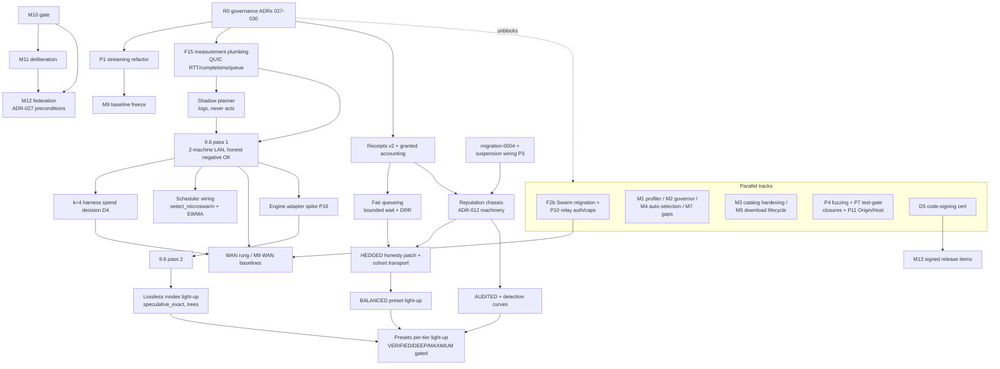

# Dependency Graph — post-gate execution ordering

Status: companion to `docs/implementation/master-roadmap.md` (ADR-027).
Encodes the architecture gate's critical path (§C.4) and the audit's hard
ordering edges. Sources: gate §C.2–§C.4 · `audit-current-system.md`
(F1–F17) · `audit-production-risk-register.md` (P1–P16) · scheduler handoff
§5 (M10 build order) · network handoff (F2b) · Test/Release sign-off
conditions (P1-before-M9, 9.6-after-F15).

## Hard edges (audit-derived; violating any invalidates downstream evidence)

1. **P1 streaming refactor BEFORE any M9 baseline freeze** (D10) — a frozen
   baseline would be invalidated by the measured 7.3× streaming change; all
   baselines label their runtime build.
2. **F15 measurement plumbing (QUIC RTT EWMA, completion distributions,
   measured queue depth) BEFORE scheduler wiring** (F3) — advertised values
   are untrusted inputs, not measurements; there is nothing to wire with
   today.
3. **F15 BEFORE the 9.6 pass-1 experiment** — planner inputs and netem
   calibration checks need `measure_rtt`.
4. **Engine adapter (P16, in-process C-API spike) BEFORE any lossless-mode
   speedup expectation** — speculative speedup over the per-token HTTP
   adapter is structurally ≤ 0; llama.cpp HTTP cannot tree-verify. 9.6 pass
   2 and every lossless mode's positive claims wait for it. Pass 1 without
   it is cheap, honest, and expected-negative — that negative is a
   first-class result.
5. **Migration-0004 (suspension DDL, P3) BEFORE suspension wiring BEFORE
   the reputation chassis** — slots-to-zero is currently impossible
   (`CHECK max_slots 1..8`); the ADR-012 policy fn has no feeder. Deploys
   nonproduction-first with snapshot + rollback SQL (D6 conditions).
6. **Receipts v2 + granted accounting BEFORE fair queueing and BEFORE any
   approximate mode is default-on** — DRR weights key on granted counters
   that do not exist yet.
7. **HEDGED honesty patch (spot-verify/agreement check + Sybil diversity)
   BEFORE BALANCED light-up** — HEDGED as speced is a fast-liar-wins mode.
8. **Relay auth + per-circuit caps (P10) BEFORE any relay internet
   exposure** (D12); **F2b Swarm migration BEFORE any WAN traversal
   claims**.
9. **9.6 pass 1 BEFORE the k=4 harness spend decision** (D4) — the pass-1
   outcome sizes the harness need; **WAN and k=4 after 9.6**.
10. **M10 gate BEFORE M11/M12**; M12 additionally per the ADR-027 federation
    preconditions (own ADR + correctness contracts + per-role profile
    attribution).
11. **Shadow planner BEFORE any acting planner** — the planner logs the plan
    it would choose and never acts until 9.6 calibrates τ.
12. **R0 governance ADRs (ADR-027..030) BEFORE all M10 protocol/wire
    items** — the preset/receipt/namespace contracts are their input.

## Graph

## Node → owner → phase

| Node | Owner (AGENTS.md roster) | Phase / gate |
|---|---|---|
| P1 streaming | Runtime (executor/gateway) + Windows (UI deltas) | pre-M9 |
| F15, F2b, P10, P5 failover mapping | Network | M8/M9 |
| Shadow planner, scheduler wiring, 9.6, engine adapter co-spike | Scheduler (+ Runtime for the adapter) | M9/M10 |
| Receipts v2, fair queueing | Scheduler + Protocol (ADR-030) + Tracker (intake) | M10 |
| migration-0004, suspension wiring | Tracker (Security review; D6 conditions) | M10 prereq |
| Reputation chassis | Security + Scheduler | M10 |
| HEDGED patch, cohort transport | Scheduler + Network | M10 |
| Presets light-up | Protocol (ADR-029) + Windows (tier UI) | M10+ |
| M1/M2/M4/M7-gap | Windows (msp-resource-engineer per D19) | product track |
| M3/M5 hardening | Runtime + Tracker | hardening track |
| P4/P7, D13 CI pins | Security + Test/Release | continuous |
| P11 Origin/Host checks | Gateway Engineer (per the D19 roster update, AGENTS.md 2026-10-09) | continuous |
| M11, M12 | gated — not started before M10 gate | per ADR-027 |
